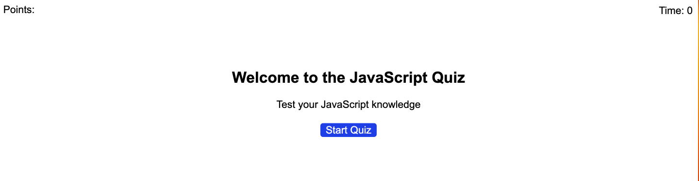

# Web-APIs-Code-Quiz

## Goal
- When clicking the 'Start Quiz' button, questions should appear. With each correct question, a point will be given. The questions must be answered before the timer runs out. 

## Screenshot

## Link to Deployed Application
https://rachelmcallister1.github.io/Web-APIs-Code-Quiz/ 
